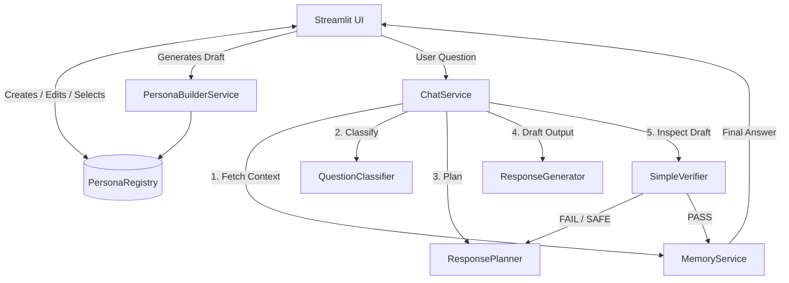

# Historical Figure Chatbot Platform

This repository implements a grounded, multi-turn conversational AI platform that allows users to interact with historically accurate personas.

## 문제 정의 (Problem Definition)

When users interact with generic LLMs configured to "act like" historical figures, the models routinely suffer from:
1. **Anachronistic Leakage:** Models leak modern terminology, experiences, or internet-awareness.
2. **Generic Tones:** Responses devolve into standard, helpful "AI" phrasing which breaks immersion.
3. **Hallucination of Traits:** Figures speak on traits and histories loosely correlated with their era, failing to anchor to their actual worldview or surviving historical evidence.

This platform solves these problems through a highly constrained **Pipeline Architecture**, ensuring strict grounding and explicit multi-stage generation, validation, and memory.

## 핵심 기능 (Core Features)

1. **Schema-Anchored Personas:** Every figure is strictly defined by a modular `PersonaDossier` (including worldview, posthumous policy, and historically grounded evidence snippets).
2. **Explicit 5-Stage Pipeline:** Chat responses don't rely on simple prompts. They progress through Question Classification → Response Planning → Generation → Verification → Memory Updating.
3. **On-the-Fly Custom Persona Generation:** Users can dynamically generate, preview, lint, and authorize custom figures using an integrated OpenAI builder.
4. **Historical Linter:** Real-time generation of custom figures incorporates a heuristic linter warning against ungrounded, anachronistic, or vague structural logic before save. 
5. **Warm, Immersive UI Layer:** A parchment-themed, editorially crafted Streamlit interface explicitly designed to foster long-form dialogue rather than transactional queries.

---

## Architecture Diagram

---

## Preset vs Custom Figure Flow

The system strongly enforces directory isolation to prevent prompt-injection overwriting core figures:

- **Presets:** Stored immutably in `app/personas`. Loaded on startup. Read-only in the UI. 
- **Customs:** Stored in `app/data/custom_personas`. Managed directly from the frontend UI.
  - **The Creation Flow:** The user triggers the `PersonaBuilderService` dialog, generating an LLM-structured layout of the required traits and historical constraints. 
  - **The Linter:** Before saving, `app/services/persona_linter.py` validates grounding depth.
  - **State Overwrites:** Explicit `overwrite=False` locks prevent users from colliding their generated IDs with System Presets (e.g. creating "Einstein" appends a random stable hash, preventing overwriting the main Einstein file).

---

## Verification Layer Explanation

A generated draft is **never** presented to the user blindly. The `SimpleVerifier` steps in prior to resolving the prompt:

1. **Catch Generic AI Patterns:** Fails the draft if phrases like "As an AI model..." are found.
2. **Modern Experience Check:** Prevents anachronistic claims based strictly on the bounds of the figure's `death_year` vs the question's era.
3. **Evading Responses:** Rejects "It depends" or overly safe non-answers uncharacteristic of historical rhetoric.
4. **Resiliency:** If a draft hits a `fail_safe` (e.g., severe historical overreach), the `ResponsePlanner` is explicitly invoked again with much stricter temporal anchors, and the system regenerates.

---

## Limitations

- The underlying response generator still relies on LLM alignment, meaning extremely aggressive adversarial prompts *can* occasionally bypass the deterministic Verifier Layer.
- Schema Validation guarantees data structures, but weak LLM generations might still produce repetitive JSON bodies despite prompting, requiring user intervention via the Custom Edit Panel. 
- The Memory layer truncates after heavy long-turn usage by replacing local history with compressed summaries. Sometimes conversational nuances are lost in translation during that compression phase.

## Future Work

- **Locking / Concurrent Writes**: Scaling out from single-user desktop Streamlit towards a deployed web-app requires adding `filelock` or strict IO constraints inside `PersonaRegistry`.
- **Database Backend**: Migrating `app/personas` out of the local file system into Postgres or MongoDB to better enable dynamic retrieval mapping.
- **Improved UX Polish**: Provide built-in validation helpers inside the raw JSON edit stream of the Manage Figures panel.
- **Exporting**: A one-click bundle tool allowing researchers to export a mature, thoroughly grounded Figure string to use in other LLM workflows (Langchain, LlamaIndex, etc.).
